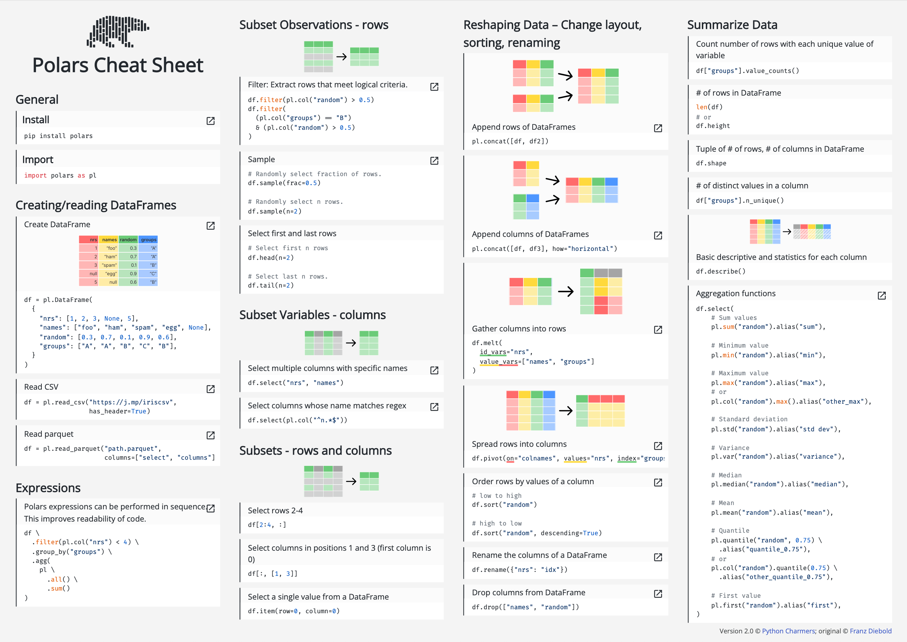

# [Polars](https://www.pola.rs/) cheat sheet

Version 2.0:

Adapted from Franz Diebold's original [Polars cheat sheet](https://franzdiebold.github.io/polars-cheat-sheet/Polars_cheat_sheet.pdf)

See accompanying Notebook: [polars-cheat-sheet.ipynb](polars-cheat-sheet.ipynb)

Most examples were taken from the official [Polars user guide](https://pola-rs.github.io/polars-book/user-guide/).
The structure is inspired by the [Pandas cheat sheet](https://pandas.pydata.org/Pandas_Cheat_Sheet.pdf).
